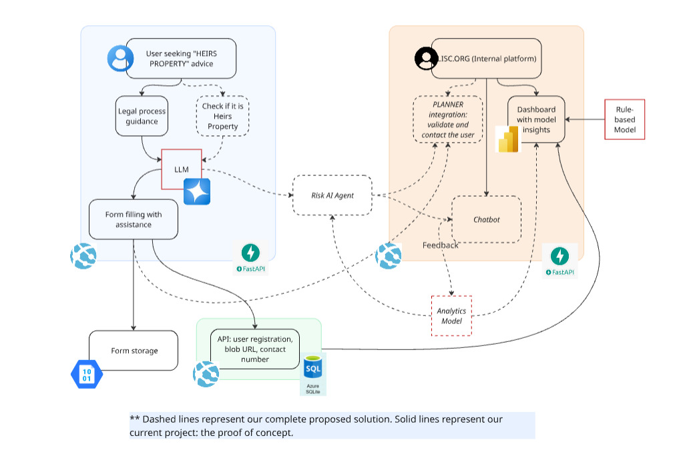

# Lantern

**Lantern** is a responsible AI platform 🤖 designed to protect families from losing generational property 🏡 due to unclear heirs' titles, unpaid taxes, or legal barriers ⚖️. We empower underserved communities in Georgia by helping them understand complex forms 📝, simplifying legal guidance, predicting property risk, and connecting individuals to human assistance 🤝, all while supporting community mapping and policy planning.

Built by **BeeCode Team** 🐝, *Lantern* combines Microsoft Azure’s AI capabilities with deep community insight to deliver clarity, justice, and connection at scale.

> *Lighting the legal path  to protect your legacy* 🔦⚖️🛡️📜

## Project Goals 🎯
- Prevent involuntary property loss in high-risk communities  
- Assist legal professionals by streamlining early case triage and risk detection  
- Empower individuals with plain-language legal guidance through chat-based assistance  
- Map and monitor risk at the neighborhood level to support nonprofits and city agencies  
- Implement Responsible AI to ensure fairness, transparency, and safety throughout the system  

##  Components 🧩  
- Risk Scoring Engine: Model to identify and quantify heirs' property vulnerability  
- Legal Assistant Chatbot: Guides users through complex forms and legal processes in plain English  
- Verification Interface: Staff-reviewed intake validation to prevent unauthorized misuse  
- Document Generator: Will auto-generate preliminary legal forms based on user data

## Architecture 🏗️

1. User Interaction
    * LLM Assistant (Azure OpenAI) provides plain-language legal guidance and checks for heirs’ property status.
    * Form Assistance helps users complete legal forms.
    * Azure Blob Storage + FastAPI + Azure SQL handle secure storage of forms and user metadata (contact info, document URL).

2. AI Risk Engine
    * Risk AI Agent evaluates property vulnerability using:
        * A Rule-Based Model (legal logic).
        * An Analytics Model (data-driven predictions).

3. Internal Platform
    * Planner Integration + Chatbot enable staff to validate and contact users.
    * Power BI Dashboard displays risk insights and prioritizes outreach.
    * Feedback Loop improves model accuracy and legal triage over time.

4. Human Validation & Document Generation
    * Verification Interface: Ensures only legitimate cases are escalated, with human-in-the-loop governance.
    * Auto Document Generator: Produces draft legal documents using collected data, ready for staff or legal review.

## Data Flow 🔄 
1. User submits a request or inquiry via chatbot  
2. AI assistant explains the situation and helps to fill the form using AI
3. Staff verifies legitimate cases, preventing fraud or misuse  
4. Dashboard highlights high-risk parcels and guiding outreach strategies 
5. The staff contacts the user to follow up on the case. However, both the user and the staff are supported by the AI for decision making.

## Responsible AI by Design 🤖
- Fairness: Bias-audited models; multilingual design
- Transparency: All predictions are explainable and sourced  
- Privacy: No personal data collected without consent  
- Safety: AI decisions are human-reviewed before action  
- Accountability: LISC staff reviews all submitted requests and validates outputs  
- Inclusiveness: UX designed for low literacy and tech exposure  

---

Lantern isn’t just an AI product, it’s a mission: To ensure no family loses their home because the system was too hard to understand.
