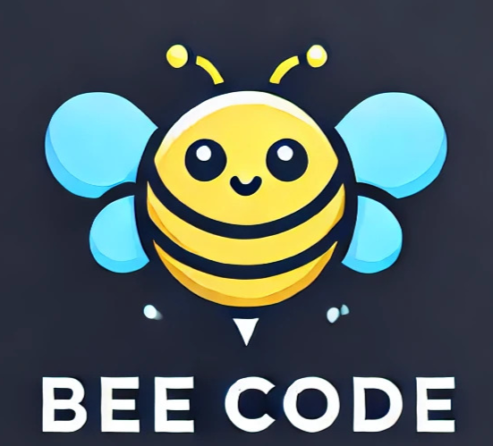

# LANTERN: Heirs Property Agent 🏠⚖️

An AI-powered FastAPI application that assists users in completing the Original Owner Worksheet of the Georgia Heirs Determination form. It provides a conversational interface via WebSockets, leveraging Azure OpenAI to guide users through required fields, and can automatically fill out the PDF form based on user-provided data.

---

## Features

- **Conversational Form Filling**  
  - Real-time chat interface over WebSockets  
  - System prompts drive the collection of required fields  
  - Tracks and updates which field was last filled  

- **PDF Generation**  
  - `main_fill_pdf.py` reads a JSON payload and populates the PDF form  
  - Built-in logical validations before writing the PDF  

- **Data Modeling**  
  - Pydantic models define the structure of each worksheet field  
  - Ensures type safety and clear descriptions for all inputs  

---

## Project Structure

```
.
├── main.py                   # FastAPI application with WebSocket endpoint
├── main_fill_pdf.py          # Standalone script to fill PDF from JSON
├── models.py                 # Pydantic models for form data and responses
├── static/
│   ├── index.html            # Frontend chat interface
│   └── …                     # Other assets (CSS, JS, images)
├── .env                      # Environment variables (not committed)
└── requirements.txt          # Python dependencies
```

---

## Requirements

- Python 3.9 or above  
- An Azure OpenAI resource with a deployment for chat completions  
- A fillable PDF form:  
  - `Heirs+Determination+Worksheet+rev+5-2022+Fillable.pdf`  

---

## Installation

1. **Clone the repository**  
   ```bash
   git clone https://github.com/Dany21x/LanternHeirsProperty/src/heirs-property-agent.git
   cd heirs-property-agent
   ```

2. **Create and activate a virtual environment**  
   ```bash
   python -m venv .venv
   source .venv/bin/activate     # macOS/Linux
   .venv\Scripts\activate        # Windows
   ```

3. **Install dependencies**  
   ```bash
   pip install -r requirements.txt
   ```

4. **Create a `.env` file** in the project root with the following variables:
   ```ini
   AZURE_OPENAI_ENDPOINT=<your-azure-openai-endpoint>
   AZURE_OPENAI_API_KEY=<your-azure-openai-api-key>
   AZURE_OPENAI_API_VERSION=<your-azure-openai-api-version>
   AZURE_OPENAI_DEPLOYMENT_NAME=<your-deployment-name>
   ```

---

## Running the FastAPI Server

```bash
uvicorn main:app --reload --host 127.0.0.1 --port 3000
```

- Open your browser and navigate to `http://127.0.0.1:3000/`  
- The chat interface will connect via WebSocket to `/ws/chat`  

---

## Filling the PDF via Script

1. Prepare a JSON file (e.g., `datos_formulario.json`) matching the `OriginalOwnerWorksheet` schema.
2. Update the constants at the top of `main_fill_pdf.py` if your filenames differ.
3. Run:
   ```bash
   python main_fill_pdf.py
   ```
4. The script will validate logical consistency and produce `Heirs_Determination_Filled.pdf`.

---

## Pydantic Models

- **OriginalOwnerWorksheet** (`models.py`)  
  Defines each field from the form, with types and descriptions.

- **WorksheetResponse**  
  - `message`: Assistant’s response to the user  
  - `form_data`: Current state of the form  
  - `field_updated`: The last field filled  

- **ChatMessage**  
  - `role`: `"user"` or `"assistant"`  
  - `content`: The message text  

---

## Extending & Customization

- **System Prompt**  
  Modify the system prompt in `main.py` to change the assistant’s behavior or add new flows.

- **Front-end**  
  Update `static/index.html` or add new assets under `static/` to change the UI.

---
🐝 **Powered by Bee Code**
<p align="center">
  
</p>
